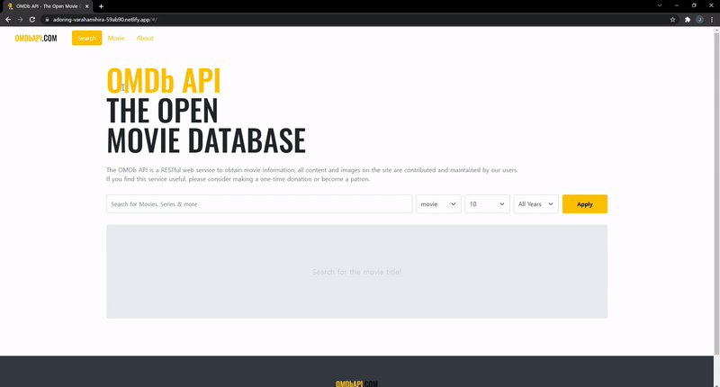

<div align="center">
  <br />
  
  <br />
  <h1>OMDbAPI.COM (영화 소개 서비스)</h1>
  <a href="https://app.netlify.com/sites/adoring-varahamihira-59ab90/deploys" target="_blank">
    
  </a>
  <br />
</div>


## 목차

1. [**웹 서비스 소개**](#1)
2. [**기술 스택**](#2)
3. [**데모 영상**](#3)
4. [**실행 방법**](#4)

<br />

<div id='1'></div>

## 💁🏻‍♂ 웹 서비스 소개

[**OMDb API**](http://www.omdbapi.com/)에서 제공하는 [**Open API**](http://www.omdbapi.com/)를 활용해 만든 **영화 정보 제공 웹 서비스**입니다.

<br />

[**🔗 배포된 웹 서비스로 바로가기 Click !**](https://adoring-varahamihira-59ab90.netlify.app/#/) 👈

> 새 창 열기 방법 : CTRL+click (on Windows and Linux) | CMD+click (on MacOS)

<br />

<div id='2'></div>

## 🛠 기술 스택


### **Front-end**

|  |  |  |  |
| :----------------------------------------------------------------------------------------------------------------------------: | :--------------------------------------------------------------------------------------------------------------------------: | :-----------------------------------------------------------------------------------------------------------------------------: | :-----------------------------------------------------------------------------------------------------------------------------: |
|                                                             HTML5                                                              |                                                             CSS3                                                             |     Sass(SCSS)                                                             |                                                    JavaScript(ES6)                                                         |

|  |  |  |
| :-----------------------------------------------------------------------------------------------------------------------------: | :-----------------------------------------------------------------------------------------------: |  :-----------------------------------------------------------------------------------------------: |
|                                                             Vue.js                                                              |                                               Vuex                                                | Bootstrap                                                |

|  |
| :---------------------------------------------------------------------------------------------------------------------------: |
|                                                            Webpack                                                            |

### **DevOps**

|  |
| :---------------------------------------------------------------------------------------------------------------------------: |
|                                                            Netlify                                                            |

### **Version Control**

|  |  |
| :---------------------------------------------------------------------------------------------------------------: | :--------------------------------------------------------------------------------------------------------------------: |
|                                                        Git                                                        |                                                         GitHub                                                         |

<br />

<div id='3'></div>

## 🎥 데모 영상

|                    메인 페이지(영화 검색)                    |
| :-----------------------------------------------: |
|  |

|                    About 페이지                    |
| :-----------------------------------------------: |
|  |

|                                      메인 페이지(모바일 / 영화 검색)                                       |                                    네비게이션을 이용한 페이지 이동(모바일)                                    |
| :--------------------------------------------------------------------------------------------: | :--------------------------------------------------------------------------------------: |
|  |  |

<br />

<div id='4'></div>

## 💻 실행 방법

1. **원격 저장소 복제**

```bash
$ git clone https://github.com/JeongHwan-dev/movie-app-with-vue
```

2. **프로젝트 폴더로 이동**

```bash
$ cd movie-app-with-vue
```

3. **필요한 node_modules 설치**

```bash
$ npm install
```

4. **개발 서버 실행**

```bash
$ npm run dev
```
