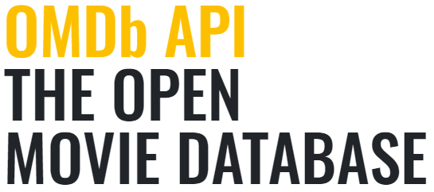

<div align="center">
  <br />
  
  <br />
  <h1>OMDbAPI.COM (영화 소개 서비스)</h1>
  <br />
</div>

## 목차

1. [**웹 서비스 소개**](#1)
2. [**기술 스택**](#2)
3. [**주요 페이지**](#3)
4. [**실행 방법**](#4)

<br />

<div id='1'></div>

## 💁🏻‍♂ 웹 서비스 소개

[**OMDb API**](http://www.omdbapi.com/)에서 제공하는 [**Open API**](http://www.omdbapi.com/)를 활용해 만든 **영화 정보 제공 웹 서비스**입니다.

<br />

[**🔗 배포된 웹 서비스로 바로가기 Click !**](https://adoring-varahamihira-59ab90.netlify.app/#/) 👈

> 새 창 열기 방법 : CTRL+click (on Windows and Linux) | CMD+click (on MacOS)

<br />

<div id='2'></div>

## 🛠 기술 스택

**Front-end**

-    
- 
- 
-    
-     

**DevOps**

- 

**Version Control**

-  

<br />

<div id='3'></div>

## 📄 주요 페이지

| 메인 페이지 |
| :---------: |
|      -      |

<br />

<div id='4'></div>

## 💻 실행 방법

1. **원격 저장소 복제**

```bash
$ git clone https://github.com/JeongHwan-dev/movie-app-with-vue
```

2. **프로젝트 폴더로 이동**

```bash
$ cd movie-app-with-vue
```

3. **필요한 node_modules 설치**

```bash
$ npm install
```

4. **개발 서버 실행**

```bash
$ npm run dev
```
